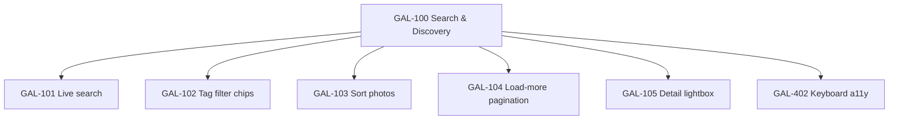
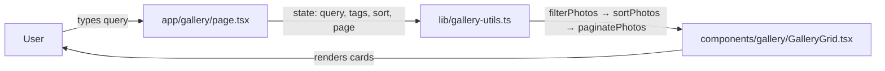

# GAL-100 · Epic · Search & Discovery experience

| Field | Value |
|-------|-------|
| **Key** | GAL-100 |
| **Type** | Epic |
| **Priority** | High |
| **Status** | In Progress |
| **Sprint** | Discovery '26 Q1–Q2 |
| **Story points (rollup)** | 34 |
| **Components** | `gallery`, `lib/gallery-utils`, `app/gallery` |
| **Labels** | discovery, search, frontend |
| **Reporter** | P. Okafor (Product) |
| **Assignee** | Gallery Squad |

## Epic summary

Visitors currently scroll a flat, unfiltered grid. As the catalog grows past a few hundred
photos, discovery collapses — people cannot find a photographer, a theme, or a specific shot.
This epic delivers a cohesive **search, filter, sort, and paginate** experience so any photo
is reachable in a few interactions.

## Business goal

> Increase gallery engagement (photos opened per session) and reduce bounce on `/gallery`.

**Success metrics**

- Median time-to-first-photo-open drops below 8s.
- ≥ 40% of gallery sessions use search, a tag chip, or sort at least once.
- Zero increase in p95 render time on the grid after filters are added.

## Child stories

## Architecture context

- Keep all transformation logic **pure** in `src/lib/gallery-utils.ts` (already the home of
  `filterPhotos`, `sortPhotos`, `paginatePhotos`, `calculateGalleryStats`).
- The page owns state; the grid stays presentational.

## Simulated attachments

- `discovery-flow-whiteboard.png` — the end-to-end search → filter → sort → open journey.
- `metrics-baseline-dashboard.png` — current engagement funnel screenshot for baseline.

## Definition of done (epic)

- [ ] All child stories closed and released behind the `discovery` flag.
- [ ] Utility functions covered per repo test matrix (happy path, empty, boundary, invalid, immutability).
- [ ] Metrics dashboard shows the three success metrics for two consecutive weeks.

## Activity

- **2026-01-12** — P. Okafor created the epic and attached the baseline funnel.
- **2026-01-20** — GAL-101 pulled into Sprint 41.
