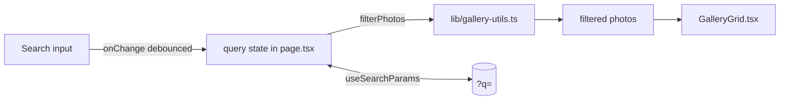

# GAL-101 · Story · Live search filtering on the gallery page

| Field | Value |
|-------|-------|
| **Key** | GAL-101 |
| **Type** | Story |
| **Priority** | High |
| **Status** | In Progress |
| **Epic** | [GAL-100](GAL-100-epic-search-discovery.md) |
| **Sprint** | Sprint 41 |
| **Story points** | 5 |
| **Components** | `app/gallery`, `lib/gallery-utils`, `gallery` |
| **Labels** | search, frontend, discovery |
| **Reporter** | P. Okafor |
| **Assignee** | M. Larsson |

## User story

> **As a** gallery visitor
> **I want** to type into a search box and see the grid filter as I type
> **so that** I can find a photo by title, tag, or photographer without scrolling.

## Background

`filterPhotos(photos, { searchQuery })` already searches across title, tags, and photographer
and trims/lowercases the query. This story wires a real input on `/gallery` to that utility and
renders the filtered result set live.

## User experience

- A labelled **Search photos** input sits above the grid, full-width on mobile.
- Filtering is **debounced ~200ms**; the grid updates without a full-page reload.
- A result count reads **"Showing N of M photos"**.
- Clearing the input (or the ✕ clear button) restores the full grid.
- Query is reflected in the URL (`?q=portrait`) so results are shareable and survive refresh.

### Simulated wireframe

```text
┌───────────────────────────────────────────────┐
│  Gallery                                        │
│  ┌───────────────────────────────┐  Sort ▾     │
│  │ 🔍  portrait                ✕ │             │
│  └───────────────────────────────┘             │
│  Showing 3 of 24 photos                         │
│  ┌──────┐ ┌──────┐ ┌──────┐                    │
│  │ IMG  │ │ IMG  │ │ IMG  │                    │
│  └──────┘ └──────┘ └──────┘                    │
└───────────────────────────────────────────────┘
```

## Simulated attachments

- `search-input-states.png` — idle, focused, with-text, and clear-button states.
- `search-results-count.png` — result-count treatment in light and dark mode.

## Architecture



**Files affected**

- `src/app/gallery/page.tsx` — input, debounce, URL sync, result count.
- `src/lib/gallery-utils.ts` — reuse `filterPhotos` (no change expected).

## Acceptance criteria

```gherkin
Scenario: Filter as the user types
  Given the gallery shows 24 photos
  When I type "portrait" into the Search photos box
  Then only photos whose title, tags, or photographer match "portrait" remain
  And the count reads "Showing 3 of 24 photos"

Scenario: Case-insensitive and trimmed
  When I type "  PORTRAIT  "
  Then the same 3 photos are shown

Scenario: No matches
  When I type "zzzz"
  Then the grid shows an empty-state message and "Showing 0 of 24 photos"

Scenario: Clearing restores everything
  Given I searched for "portrait"
  When I clear the input
  Then all 24 photos are shown again

Scenario: Shareable URL
  When I search for "sunset"
  Then the URL contains "?q=sunset"
  And reloading the page keeps the "sunset" results
```

## Test notes

- Reuse the `makePhoto` factory from `src/lib/gallery-utils.test.ts`.
- Component tests: query by the **Search photos** accessible label; assert visible cards and the
  count. Cover empty-match and clear-and-restore transitions.

## Definition of done

- [ ] Live filtering, debounced, with URL sync and result count.
- [ ] Component + utility tests green; empty and clear paths covered.
- [ ] Keyboard accessible (see [GAL-402](GAL-402-gallery-keyboard-a11y.md)).

## Activity

- **2026-01-22** — Pulled into Sprint 41, estimated 5.
- **2026-01-24** — M. Larsson: reusing `filterPhotos`, no utility change needed.
