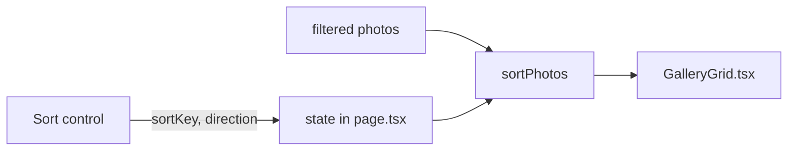

# GAL-103 · Story · Sort photos by likes, title, or recency

| Field | Value |
|-------|-------|
| **Key** | GAL-103 |
| **Type** | Story |
| **Priority** | Medium |
| **Status** | To Do |
| **Epic** | [GAL-100](GAL-100-epic-search-discovery.md) |
| **Sprint** | Sprint 42 |
| **Story points** | 3 |
| **Components** | `app/gallery`, `lib/gallery-utils`, `gallery` |
| **Labels** | sort, frontend, discovery, good-for-tdd |
| **Reporter** | P. Okafor |
| **Assignee** | Unassigned |

## User story

> **As a** visitor
> **I want** to sort the grid by most-liked, title, or newest
> **so that** I can browse in the order that matters to me.

## Background

`sortPhotos(photos, key, direction)` already sorts by `likes` (desc default) and `title`
(locale compare) and **does not mutate** its input, pushing missing sort values to the end.
This story adds a sort control and, if needed, a `recency` key.

## User experience

- A **Sort by** dropdown: *Most liked* (default), *Title A–Z*, *Newest first*.
- Selection re-orders the currently filtered set instantly.
- Selected sort persists in the URL (`?sort=title`) alongside `?q=`.

### Simulated wireframe

```text
                                   Sort by ▾  [ Most liked ]
                                              ├ Most liked
                                              ├ Title A–Z
                                              └ Newest first
```

## Simulated attachments

- `sort-dropdown-open.png` — open menu with the three options.
- `sort-applied-grid.png` — grid before/after "Title A–Z".

## Architecture



**Files affected**

- `src/app/gallery/page.tsx` — sort control + URL sync.
- `src/lib/gallery-utils.ts` — extend for a `recency`/`createdAt` key if the model supports it.

## Acceptance criteria

```gherkin
Scenario: Default sort is most liked
  Given no sort is selected
  Then photos are ordered by likes descending

Scenario: Sort by title
  When I choose "Title A–Z"
  Then photos are ordered by title using locale comparison

Scenario: Missing sort values sink to the end
  Given one photo has no likes value
  When I sort by likes
  Then that photo appears last

Scenario: Sorting does not mutate the source
  When I switch between sort options repeatedly
  Then the original photo array order is never modified

Scenario: Sort persists in the URL
  When I choose "Newest first"
  Then the URL contains "?sort=newest" and survives reload
```

## Test notes (TDD-friendly)

This story is a good fit for **Lab 06**: write the `sortPhotos` cases first (default desc,
ascending, title locale, missing-value sink, non-mutation), then wire the control.

## Definition of done

- [ ] Three sort modes, URL-persisted, immutable transform.
- [ ] Utility + component tests green, including the non-mutation and missing-value cases.

## Activity

- **2026-01-28** — Flagged `good-for-tdd`; pairs with the work-item lab.
