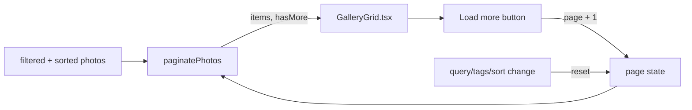

# GAL-104 · Story · Paginated "load more" gallery

| Field | Value |
|-------|-------|
| **Key** | GAL-104 |
| **Type** | Story |
| **Priority** | High |
| **Status** | To Do |
| **Epic** | [GAL-100](GAL-100-epic-search-discovery.md) |
| **Sprint** | Sprint 43 |
| **Story points** | 5 |
| **Components** | `app/gallery`, `lib/gallery-utils`, `gallery` |
| **Labels** | pagination, performance, frontend |
| **Reporter** | P. Okafor |
| **Assignee** | Unassigned |

## User story

> **As a** visitor with a large catalog
> **I want** the grid to load a page at a time with a "Load more" button
> **so that** the page stays fast and I control how much I see.

## Background

`paginatePhotos(items, page, perPage)` returns `{ items, totalItems, totalPages, currentPage,
hasMore }`, clamps `perPage` to a minimum of 1, and returns empty items for out-of-range pages.
This story renders pages incrementally and appends on demand.

## User experience

- Initial render shows **page 1** (default 6 per page).
- A **Load more** button appends the next page; it hides when `hasMore` is false.
- Applying a search, tag, or sort **resets to page 1**.
- A subtle "You've reached the end" line shows on the final page.

### Simulated wireframe

```text
┌──────┐ ┌──────┐ ┌──────┐
│ IMG  │ │ IMG  │ │ IMG  │
└──────┘ └──────┘ └──────┘
┌──────┐ ┌──────┐ ┌──────┐
│ IMG  │ │ IMG  │ │ IMG  │
└──────┘ └──────┘ └──────┘
            [  Load more  ]
```

## Simulated attachments

- `load-more-button.png` — default, hover, and disabled/hidden end-state.
- `pagination-reset-on-filter.gif` — filtering snaps back to page 1.

## Architecture



**Files affected**

- `src/app/gallery/page.tsx` — page state, append logic, reset-on-filter.
- `src/lib/gallery-utils.ts` — reuse `paginatePhotos` (no change expected).

## Acceptance criteria

```gherkin
Scenario: First page and load more
  Given 9 photos and a page size of 6
  Then 6 photos render and "Load more" is visible
  When I click "Load more"
  Then all 9 photos render and "Load more" is hidden

Scenario: Final partial page
  Given the last page has fewer than a full page of photos
  Then only the remaining photos render and hasMore is false

Scenario: Reset on filter change
  Given I have loaded page 2
  When I type a search query
  Then the grid returns to page 1 of the filtered results

Scenario: Out-of-range safety
  When the effective page is beyond the total pages
  Then no photos render and no error is thrown

Scenario: No duplicate cards on rapid clicks
  When I click "Load more" twice quickly
  Then each photo appears exactly once (guard against double-append)
```

## Test notes

- The **no-duplicate** scenario is a known regression class — assert unique keys after two rapid
  appends. Cover out-of-range and `perPage` clamp via the utility tests.

## Definition of done

- [ ] Incremental append, reset-on-filter, end-state message.
- [ ] No duplicate cards under rapid interaction.
- [ ] Utility + component tests green.

## Activity

- **2026-02-01** — Noted duplicate-append risk from a prior incident; added AC.
