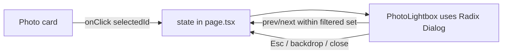

# GAL-105 · Story · Photo detail lightbox modal

| Field | Value |
|-------|-------|
| **Key** | GAL-105 |
| **Type** | Story |
| **Priority** | High |
| **Status** | To Do |
| **Epic** | [GAL-100](GAL-100-epic-search-discovery.md) |
| **Sprint** | Sprint 43 |
| **Story points** | 8 |
| **Components** | `gallery`, `ui`, `app/gallery` |
| **Labels** | modal, a11y, frontend |
| **Reporter** | P. Okafor |
| **Assignee** | Unassigned |

## User story

> **As a** visitor
> **I want** to open a photo in a focused lightbox with its details
> **so that** I can view it larger and see metadata without leaving the grid.

## User experience

- Clicking a card opens a centered modal with the large image, title, photographer, tags, and
  like/view/download counts.
- The modal traps focus, closes on **Esc** and on backdrop click, and restores focus to the
  originating card on close.
- **←/→** navigate to the previous/next photo in the current filtered set.
- Body scroll is locked while open.

### Simulated wireframe

```text
        ┌───────────────────────────── ✕ ┐
        │                                  │
   ‹    │            LARGE IMAGE           │    ›
        │                                  │
        │  Portrait Study — Jane Smith     │
        │  #portrait #studio   ♥ 80  ⤓ 12  │
        └──────────────────────────────────┘
             (backdrop dims the grid)
```

## Simulated attachments

- `lightbox-desktop.png` — full modal with prev/next arrows.
- `lightbox-mobile.png` — full-bleed layout, swipe hint.
- `lightbox-focus-order.png` — annotated focus-trap order.

## Architecture



**Files affected**

- `src/components/gallery/` — new `PhotoLightbox` built on `@radix-ui/react-dialog`.
- `src/app/gallery/page.tsx` — selected-photo state and keyboard navigation.

## Acceptance criteria

```gherkin
Scenario: Open and close
  When I click a photo card
  Then a modal opens with that photo's image and metadata
  When I press Esc or click the backdrop
  Then the modal closes and focus returns to the originating card

Scenario: Keyboard navigation
  Given the lightbox is open on photo 2 of 5
  When I press ArrowRight
  Then photo 3 of the filtered set is shown

Scenario: Focus is trapped
  Given the lightbox is open
  When I press Tab repeatedly
  Then focus cycles only within the modal

Scenario: Boundaries
  Given the lightbox is open on the first photo
  When I press ArrowLeft
  Then it stays on the first photo (or wraps, per design) without error

Scenario: Body scroll lock
  Given the lightbox is open
  Then the underlying page does not scroll
```

## Test notes

- Use Testing Library dialog semantics: assert `role="dialog"`, focus trap, Esc close, and
  focus restoration. Cover first/last boundary navigation.

## Definition of done

- [ ] Accessible dialog with focus trap, Esc/backdrop close, focus restore.
- [ ] Keyboard prev/next within the filtered set.
- [ ] Component tests green including boundaries.

## Activity

- **2026-02-03** — Sized 8; a11y review required before release.
