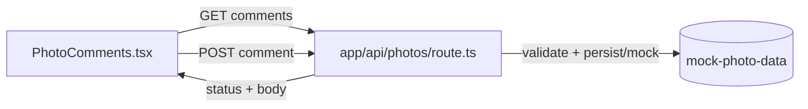

# GAL-106 · Story · Comments on a photo

| Field | Value |
|-------|-------|
| **Key** | GAL-106 |
| **Type** | Story |
| **Priority** | Medium |
| **Status** | To Do |
| **Epic** | [GAL-100](GAL-100-epic-search-discovery.md) |
| **Sprint** | Sprint 44 |
| **Story points** | 5 |
| **Components** | `gallery`, `app/api/photos`, `lib` |
| **Labels** | comments, api, frontend |
| **Reporter** | P. Okafor |
| **Assignee** | Unassigned |

## User story

> **As a** signed-in visitor
> **I want** to read and post comments on a photo
> **so that** I can give the photographer feedback and join the conversation.

## Background

A `PhotoComments` component already exists under `src/components/gallery/`. This story gives it a
real data path: list existing comments and submit a new one through the photos API.

## User experience

- The lightbox (GAL-105) shows a **Comments** section below the metadata.
- Existing comments list author, relative time, and body.
- A textarea + **Post** button submits a comment; the field clears on success.
- **Post** is disabled for empty/whitespace-only input and while a submit is in flight.
- Failures show an inline, non-destructive error and keep the draft text.

### Simulated wireframe

```text
Comments (3)
─────────────────────────────
Ann • 2h ago
  Beautiful light on this one.
Bob • 1h ago
  Where was this taken?
─────────────────────────────
┌───────────────────────────┐
│ Add a comment…            │
└───────────────────────────┘
                    [ Post ]
```

## Simulated attachments

- `comments-list.png` — populated list with relative timestamps.
- `comments-empty.png` — "Be the first to comment" empty state.
- `comments-error-inline.png` — failed submit with preserved draft.

## Architecture



**Files affected**

- `src/components/gallery/PhotoComments.tsx` — list, form, states.
- `src/app/api/photos/` — comment read/create handlers.

## Acceptance criteria

```gherkin
Scenario: List existing comments
  Given a photo has 3 comments
  Then all 3 render with author and relative time

Scenario: Post a valid comment
  When I type "Great shot" and click Post
  Then the comment appears at the top and the field clears

Scenario: Reject empty input
  When the textarea is empty or whitespace-only
  Then Post is disabled

Scenario: Empty state
  Given a photo has no comments
  Then a "Be the first to comment" message is shown

Scenario: Submit failure keeps the draft
  Given the API returns an error
  When I click Post
  Then an inline error shows and my typed text is preserved

Scenario: No double submit
  When I click Post twice quickly
  Then only one comment is created
```

## Test notes

- Mock the API boundary, not the component logic. Assert disabled-empty, success-clear,
  error-preserves-draft, and single-submit. Verify errors don't leak internal details.

## Definition of done

- [ ] Read + create wired with validation and states.
- [ ] Handler covers valid, empty, and failure paths.
- [ ] Component + route tests green.

## Activity

- **2026-02-05** — Depends on GAL-105 lightbox container.
