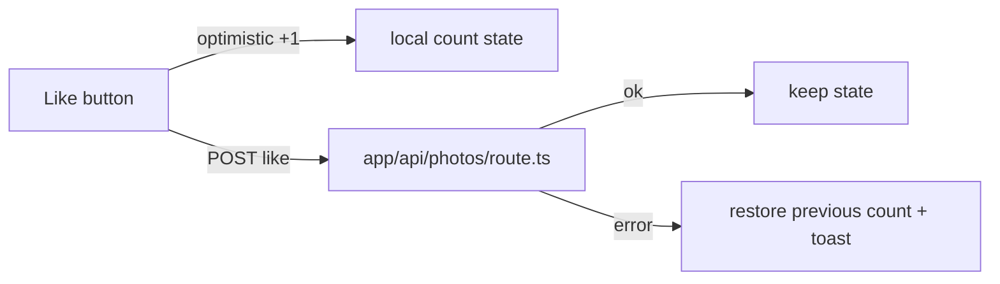

# GAL-107 · Story · Like a photo with optimistic UI

| Field | Value |
|-------|-------|
| **Key** | GAL-107 |
| **Type** | Story |
| **Priority** | Medium |
| **Status** | To Do |
| **Epic** | [GAL-100](GAL-100-epic-search-discovery.md) |
| **Sprint** | Sprint 44 |
| **Story points** | 3 |
| **Components** | `gallery`, `app/api/photos` |
| **Labels** | likes, optimistic-ui, good-for-tdd |
| **Reporter** | P. Okafor |
| **Assignee** | Unassigned |

## User story

> **As a** visitor
> **I want** to like a photo and see the count update immediately
> **so that** I can show appreciation without waiting for a round-trip.

## User experience

- Each card and the lightbox show a heart with a like count.
- Clicking toggles like state and updates the count **optimistically**.
- If the request fails, the UI **rolls back** to the prior count and shows a brief toast.
- Rapid toggling is coalesced so the final state matches the last click.

### Simulated wireframe

```text
   ♡ 80        →  click  →   ♥ 81   (optimistic)
   ♥ 81        →  fail   →   ♡ 80   + toast "Couldn't save your like"
```

## Simulated attachments

- `like-toggle-states.png` — unliked, liked, and rollback toast.

## Architecture



**Files affected**

- `src/components/gallery/` — like button + optimistic state.
- `src/app/api/photos/` — like/unlike handler.

## Acceptance criteria

```gherkin
Scenario: Optimistic like
  Given a photo shows 80 likes
  When I click the heart
  Then it immediately shows 81 and a filled heart

Scenario: Rollback on failure
  Given the like request will fail
  When I click the heart
  Then the count returns to 80 and a toast explains the failure

Scenario: Toggle off
  Given I have liked a photo (81)
  When I click the heart again
  Then it returns to 80 and an outline heart

Scenario: Rapid toggling settles correctly
  When I click the heart three times quickly
  Then the final state matches an odd/even count consistent with the last click

Scenario: Count never goes negative
  Given a photo shows 0 likes
  When an unlike somehow fires
  Then the count is clamped at 0
```

## Test notes (TDD-friendly)

Good **Lab 06** candidate. Write the reducer/state cases first: optimistic increment, rollback,
toggle-off, clamp-at-zero, and last-click-wins. Mock the API boundary in component tests.

## Definition of done

- [ ] Optimistic update with rollback + toast.
- [ ] Clamp at zero; last-click-wins under rapid toggling.
- [ ] Unit + component tests green.

## Activity

- **2026-02-05** — Flagged `good-for-tdd`.
