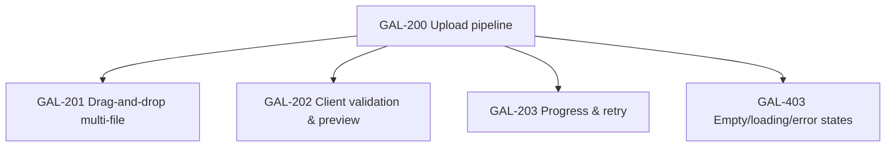
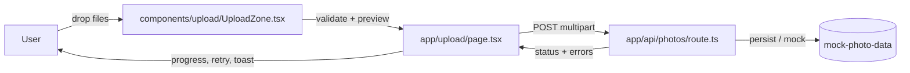

# GAL-200 · Epic · Upload pipeline modernization

| Field | Value |
|-------|-------|
| **Key** | GAL-200 |
| **Type** | Epic |
| **Priority** | High |
| **Status** | To Do |
| **Sprint** | Uploads '26 Q2 |
| **Story points (rollup)** | 29 |
| **Components** | `upload`, `app/upload`, `app/api/photos` |
| **Labels** | uploads, reliability, frontend |
| **Reporter** | D. Reyes (Product) |
| **Assignee** | Uploads Squad |

## Epic summary

The current upload page accepts a drop but gives little feedback and no validation, so users
submit oversized or unsupported files and see silent failures. This epic makes uploads
**trustworthy**: clear validation, live previews, visible progress, and recoverable errors.

## Business goal

> Reduce failed-upload support tickets and increase completed uploads per contributor.

**Success metrics**

- Upload success rate ≥ 98% for supported file types.
- < 1% of uploads rejected *after* submission (shift rejection to client-side validation).
- Every rejected file shows a specific, actionable reason.

## Child stories

## Architecture context

## Simulated attachments

- `upload-empty-state.png` — dashed drop zone, idle.
- `upload-validation-errors.png` — three files, one rejected for size, one for type.
- `upload-progress-bars.png` — per-file progress with a retry affordance.

## Definition of done (epic)

- [ ] Validation happens before submission at the `UploadZone` boundary.
- [ ] API route covers valid, malformed, oversized, and unsupported payloads.
- [ ] No stack traces or internal paths leak in error responses.

## Activity

- **2026-02-02** — D. Reyes created the epic from Q1 support-ticket analysis.
