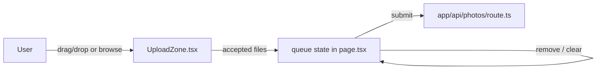

# GAL-201 · Story · Drag-and-drop multi-file upload

| Field | Value |
|-------|-------|
| **Key** | GAL-201 |
| **Type** | Story |
| **Priority** | High |
| **Status** | To Do |
| **Epic** | [GAL-200](GAL-200-epic-upload-pipeline.md) |
| **Sprint** | Sprint 42 |
| **Story points** | 5 |
| **Components** | `upload`, `app/upload` |
| **Labels** | uploads, dnd, frontend |
| **Reporter** | D. Reyes |
| **Assignee** | Unassigned |

## User story

> **As a** contributor
> **I want** to drag several photos onto the page at once
> **so that** I can add a batch without picking files one at a time.

## Background

`UploadZone.tsx` already uses `react-dropzone`. This story confirms multi-file selection, a
queue view, and per-file removal before submission.

## User experience

- A large dashed drop zone highlights on drag-over.
- Dropping (or browsing) adds files to a **queue** with thumbnail, name, and size.
- Each queued file has a **remove (✕)** control.
- A **Clear all** action empties the queue.
- Keyboard users can open the file dialog via the zone (Enter/Space).

### Simulated wireframe

```text
┌───────────────────────────────────────────┐
│                                            │
│      ⬆  Drag & drop photos here            │
│         or click to browse                 │
│                                            │
└───────────────────────────────────────────┘
Queue (2)                             Clear all
  [🖼] beach.jpg   1.2 MB           ✕
  [🖼] forest.png  3.4 MB           ✕
                                   [ Upload ]
```

## Simulated attachments

- `dropzone-idle.png`, `dropzone-dragover.png` — idle vs. active highlight.
- `upload-queue.png` — queued files with remove controls.

## Architecture



**Files affected**

- `src/components/upload/UploadZone.tsx` — DnD, keyboard open, accepted files.
- `src/app/upload/page.tsx` — queue state, remove/clear, submit trigger.

## Acceptance criteria

```gherkin
Scenario: Drop multiple files
  When I drop 3 image files
  Then all 3 appear in the queue with name and size

Scenario: Drag-over feedback
  When I drag files over the zone
  Then the zone shows an active highlight

Scenario: Remove one file
  Given 3 files are queued
  When I click ✕ on the second
  Then 2 files remain in original order

Scenario: Clear all
  Given files are queued
  When I click "Clear all"
  Then the queue is empty

Scenario: Keyboard open
  When I focus the zone and press Enter
  Then the file dialog opens
```

## Test notes

- Query the zone by accessible name; simulate drop with Testing Library file fixtures. Cover
  remove-preserves-order and clear-all.

## Definition of done

- [ ] Multi-file DnD + browse + keyboard open.
- [ ] Queue with per-file remove and clear-all.
- [ ] Component tests green.

## Activity

- **2026-02-06** — Precursor to validation (GAL-202).
