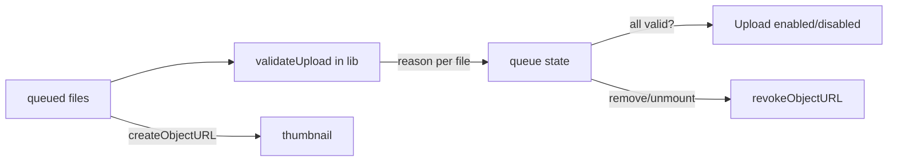

# GAL-202 · Story · Client-side image validation & preview

| Field | Value |
|-------|-------|
| **Key** | GAL-202 |
| **Type** | Story |
| **Priority** | High |
| **Status** | To Do |
| **Epic** | [GAL-200](GAL-200-epic-upload-pipeline.md) |
| **Sprint** | Sprint 43 |
| **Story points** | 5 |
| **Components** | `upload`, `app/upload`, `lib` |
| **Labels** | uploads, validation, frontend |
| **Reporter** | D. Reyes |
| **Assignee** | Unassigned |

## User story

> **As a** contributor
> **I want** unsupported or oversized files rejected before I submit, with a live preview
> **so that** I fix problems immediately instead of after a failed upload.

## Background

Shift rejection to the client (epic metric: < 1% post-submission rejections). Validation should
live in a **pure utility** so it is easy to test.

## User experience

- Accepted types: **JPEG, PNG, WebP**. Max size: **10 MB** per file.
- Each queued file shows a thumbnail preview generated locally.
- Invalid files are marked with a **specific** reason ("Unsupported type", "Exceeds 10 MB").
- The **Upload** button is disabled while any invalid file remains in the queue.
- Object URLs for previews are revoked on removal/unmount (no memory leak).

### Simulated wireframe

```text
Queue (3)
  [🖼] beach.jpg    1.2 MB   ✓ ready
  [⚠] notes.pdf     0.4 MB   ✗ Unsupported type
  [⚠] huge.png     18.0 MB   ✗ Exceeds 10 MB
Upload disabled — resolve 2 issues
```

## Simulated attachments

- `validation-mixed-queue.png` — valid + two distinct rejection reasons.
- `preview-thumbnails.png` — locally generated previews.

## Architecture



**Files affected**

- `src/lib/` — new pure `validateUpload(file, { maxBytes, accepted })`.
- `src/components/upload/UploadZone.tsx` / `src/app/upload/page.tsx` — reasons, previews, revoke.

## Acceptance criteria

```gherkin
Scenario: Accept supported type within size
  Given a 2 MB JPEG
  Then it is marked ready with a preview

Scenario: Reject unsupported type
  Given a PDF file
  Then it is marked "Unsupported type" and Upload is disabled

Scenario: Reject oversize
  Given an 18 MB PNG
  Then it is marked "Exceeds 10 MB"

Scenario: Boundary at exactly 10 MB
  Given a file of exactly 10 MB
  Then it is accepted (inclusive limit)

Scenario: Zero-byte file
  Given a 0-byte file
  Then it is rejected with a clear reason

Scenario: Preview cleanup
  When I remove a file or leave the page
  Then its object URL is revoked
```

## Test notes

- Unit-test `validateUpload` with `it.each`: supported types, unsupported type, over/at/under the
  limit (boundary), and 0-byte. Component test the disabled-upload gate and URL revocation.

## Definition of done

- [ ] Pure validation utility with full boundary coverage.
- [ ] Specific per-file reasons; Upload gated on validity.
- [ ] Object URLs revoked; tests green.

## Activity

- **2026-02-07** — Confirmed inclusive 10 MB boundary with product.
