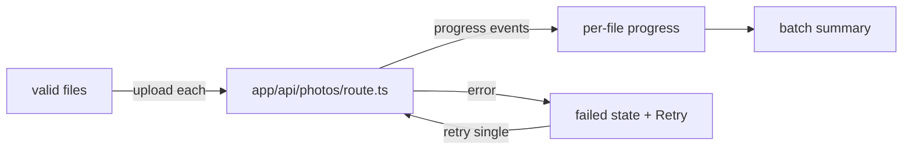

# GAL-203 · Story · Upload progress and retry

| Field | Value |
|-------|-------|
| **Key** | GAL-203 |
| **Type** | Story |
| **Priority** | Medium |
| **Status** | To Do |
| **Epic** | [GAL-200](GAL-200-epic-upload-pipeline.md) |
| **Sprint** | Sprint 44 |
| **Story points** | 5 |
| **Components** | `upload`, `app/upload`, `app/api/photos` |
| **Labels** | uploads, reliability, frontend |
| **Reporter** | D. Reyes |
| **Assignee** | Unassigned |

## User story

> **As a** contributor uploading several photos
> **I want** to see per-file progress and retry failures
> **so that** one bad file doesn't force me to restart the whole batch.

## User experience

- Each file shows an individual progress bar during upload.
- On success it shows a check; on failure it shows an error with a **Retry** button.
- A batch summary reads **"4 of 5 uploaded"**; only failed files can be retried.
- Navigating away mid-upload warns about in-flight files.

### Simulated wireframe

```text
Uploading…
  beach.jpg    ▓▓▓▓▓▓▓▓▓▓ 100%  ✓
  forest.png   ▓▓▓▓▓▓░░░░  62%
  portrait.jpg ▓▓░░░░░░░░  ✗ Failed   [ Retry ]
Batch: 1 of 3 uploaded
```

## Simulated attachments

- `upload-progress-mixed.png` — success, in-progress, and failed rows.
- `upload-retry-flow.gif` — retrying a single failed file.

## Architecture



**Files affected**

- `src/app/upload/page.tsx` — per-file status machine, batch summary, unload guard.
- `src/app/api/photos/` — accept individual uploads, return per-file status.

## Acceptance criteria

```gherkin
Scenario: Per-file progress
  When a batch uploads
  Then each file shows its own progress independently

Scenario: Partial failure
  Given one of three files fails
  Then it shows Failed with Retry and the summary reads "2 of 3 uploaded"

Scenario: Retry only the failed file
  When I click Retry on the failed file
  Then only that file re-uploads; the others are untouched

Scenario: Retry succeeds
  Given a previously failed file
  When retry succeeds
  Then the summary updates to "3 of 3 uploaded"

Scenario: Navigation guard
  Given uploads are in flight
  When I try to leave the page
  Then I am warned about unfinished uploads
```

## Test notes

- Model status as a small state machine (`queued → uploading → success | failed → uploading`).
  Unit-test transitions; component-test retry isolation and summary counts with a mocked API.

## Definition of done

- [ ] Independent per-file progress and retry.
- [ ] Accurate batch summary; unload guard.
- [ ] State-machine unit tests + component tests green.

## Activity

- **2026-02-08** — Depends on GAL-202 validation landing first.
