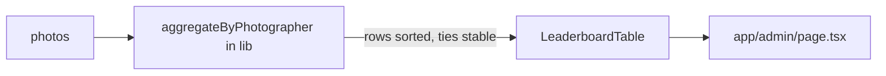

# GAL-302 · Story · Photographer leaderboard

| Field | Value |
|-------|-------|
| **Key** | GAL-302 |
| **Type** | Story |
| **Priority** | Low |
| **Status** | Backlog |
| **Epic** | — |
| **Sprint** | Unscheduled |
| **Story points** | 5 |
| **Components** | `app/admin`, `lib`, `ui` |
| **Labels** | admin, leaderboard, analytics |
| **Reporter** | S. Ito |
| **Assignee** | Unassigned |

## User story

> **As an** admin
> **I want** a ranked list of photographers by total likes
> **so that** I can recognize top contributors and feature their work.

## User experience

- A ranked table: rank, photographer, photo count, total likes, total views.
- Default sort by total likes desc; column headers toggle sort.
- **Ties** break alphabetically by photographer name for stable ordering.
- Photographers with missing/blank names are grouped under "Unknown".

### Simulated wireframe

```text
#  Photographer     Photos  Likes  Views
1  Ann                 8    540    9,200
2  John Doe            6    420    6,100
3  Jane Smith          5    420    5,400   ← tie broken alphabetically
4  Unknown             2     35      900
```

## Simulated attachments

- `leaderboard-table.png` — ranked table with sortable headers.
- `leaderboard-ties.png` — annotated tie-break behavior.

## Architecture



**Files affected**

- `src/lib/` — new pure `aggregateByPhotographer(photos)`.
- `src/components/` — `LeaderboardTable`.
- `src/app/admin/page.tsx` — mount the table.

## Acceptance criteria

```gherkin
Scenario: Rank by total likes
  Given photographers with differing like totals
  Then they are ordered from highest to lowest total likes

Scenario: Stable tie-break
  Given two photographers with equal likes
  Then they are ordered alphabetically by name

Scenario: Missing names grouped
  Given photos with blank or missing photographer
  Then their metrics roll up under "Unknown"

Scenario: Empty dataset
  Given no photos
  Then the table shows an empty state, not an error

Scenario: Aggregation does not mutate input
  When the leaderboard computes
  Then the source photos array is unchanged
```

## Test notes

- Unit-test `aggregateByPhotographer`: ranking, stable ties, "Unknown" grouping, empty input,
  and non-mutation. Reuse the `makePhoto` factory.

## Definition of done

- [ ] Pure aggregation with stable tie-break and "Unknown" grouping.
- [ ] Sortable table; empty state.
- [ ] Unit + component tests green.

## Activity

- **2026-02-11** — Parked as Low; nice-to-have after GAL-301.
