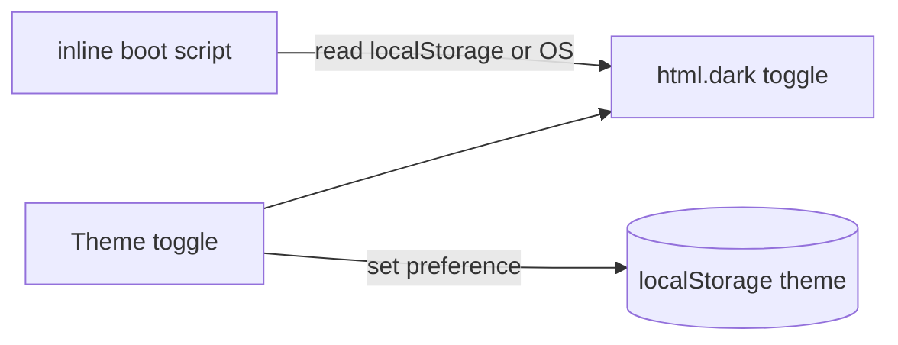

# GAL-401 · Story · Persist dark-mode preference

| Field | Value |
|-------|-------|
| **Key** | GAL-401 |
| **Type** | Story |
| **Priority** | Low |
| **Status** | To Do |
| **Epic** | — |
| **Sprint** | Sprint 45 |
| **Story points** | 2 |
| **Components** | `app`, `ui/layout` |
| **Labels** | theming, dark-mode, frontend |
| **Reporter** | S. Ito |
| **Assignee** | Unassigned |

## User story

> **As a** returning visitor
> **I want** my light/dark choice remembered
> **so that** the site opens in my preferred theme every time.

## Background

The app already uses Tailwind `dark:` variants throughout. This story adds a toggle that
persists the choice and respects the OS default on first visit.

## User experience

- A theme toggle in the header (sun/moon).
- First visit follows `prefers-color-scheme`; an explicit choice overrides it.
- The choice persists in `localStorage` and applies before first paint (no flash).
- Toggling updates the whole app immediately.

### Simulated wireframe

```text
Header ······································· [ ☀ / 🌙 ]
first visit → follows OS   ·   after click → remembered
```

## Simulated attachments

- `theme-toggle-header.png` — toggle placement, both states.
- `no-flash-boot.gif` — correct theme applied before first paint.

## Architecture



**Files affected**

- `src/app/layout.tsx` — pre-paint theme boot script.
- `src/components/ui/layout/` — theme toggle control.

## Acceptance criteria

```gherkin
Scenario: First visit follows OS
  Given no stored preference and OS prefers dark
  Then the app loads in dark mode

Scenario: Explicit choice persists
  When I switch to light and reload
  Then the app loads in light mode

Scenario: No flash of wrong theme
  When I reload in dark mode
  Then I never see a light flash before dark applies

Scenario: Toggle updates immediately
  When I click the toggle
  Then the theme changes without reload

Scenario: Corrupted stored value
  Given localStorage holds an invalid theme value
  Then the app falls back to the OS preference without error
```

## Test notes

- Unit-test the preference resolver (stored valid, stored invalid → OS fallback, no stored → OS).
  Component-test toggle behavior with a mocked `matchMedia` and storage.

## Definition of done

- [ ] Persisted, OS-aware, flash-free theming.
- [ ] Corrupted-value fallback.
- [ ] Unit + component tests green.

## Activity

- **2026-02-11** — Quick win; 2 points.
