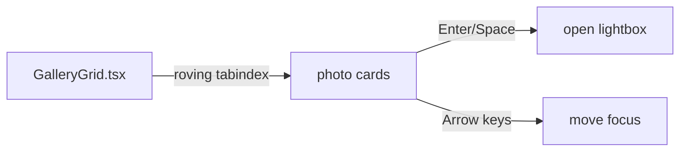

# GAL-402 · Story · Keyboard-accessible gallery grid

| Field | Value |
|-------|-------|
| **Key** | GAL-402 |
| **Type** | Story |
| **Priority** | High |
| **Status** | To Do |
| **Epic** | [GAL-100](GAL-100-epic-search-discovery.md) |
| **Sprint** | Sprint 44 |
| **Story points** | 5 |
| **Components** | `gallery`, `app/gallery`, `ui` |
| **Labels** | a11y, keyboard, wcag |
| **Reporter** | R. Mbeki (Accessibility) |
| **Assignee** | Unassigned |

## User story

> **As a** keyboard-only user
> **I want** to navigate and open photos without a mouse
> **so that** the gallery is fully usable with assistive technology.

## Background

Meets WCAG 2.1 AA for keyboard operability. Complements the lightbox (GAL-105) focus handling.

## User experience

- Every card is reachable via **Tab** with a visible focus ring.
- **Enter/Space** on a focused card opens the lightbox.
- Arrow keys move focus across the grid (left/right within a row, up/down across rows).
- Focus order follows visual order; no keyboard traps outside the intended modal.
- Cards expose an accessible name (title + photographer).

### Simulated wireframe

```text
[card]→Tab→[card]→Tab→[card]
  ▲                     │
  └──── ArrowUp ────────┘   Enter = open lightbox
Focus ring is clearly visible on the active card.
```

## Simulated attachments

- `focus-ring-cards.png` — visible focus indicator on a card.
- `keyboard-nav-map.png` — arrow-key movement across the grid.

## Architecture



**Files affected**

- `src/components/gallery/GalleryGrid.tsx` — roving tabindex, key handlers, ARIA names.
- `src/app/gallery/page.tsx` — open-on-activate wiring.

## Acceptance criteria

```gherkin
Scenario: Tab reaches every card
  When I press Tab through the grid
  Then each card receives visible focus in visual order

Scenario: Activate with keyboard
  Given a card is focused
  When I press Enter or Space
  Then its lightbox opens

Scenario: Arrow navigation
  Given a card is focused
  When I press ArrowRight
  Then focus moves to the next card in the row

Scenario: Edge of grid
  Given the last card in a row is focused
  When I press ArrowRight
  Then focus behaves predictably (next row or stop) without a trap

Scenario: Accessible names
  Then each card exposes a name combining title and photographer
```

## Test notes

- Use `@testing-library/user-event` keyboard APIs. Assert focus movement, Enter/Space activation,
  and accessible names via role/name queries — not CSS classes.

## Definition of done

- [ ] Full keyboard operability with visible focus and roving tabindex.
- [ ] Accessible card names; no unintended traps.
- [ ] Component tests green; axe check passes.

## Activity

- **2026-02-09** — Accessibility team flagged as release-blocking for GAL-100.
