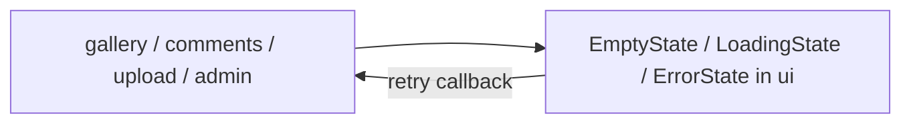

# GAL-403 · Story · Consistent empty / loading / error states

| Field | Value |
|-------|-------|
| **Key** | GAL-403 |
| **Type** | Story |
| **Priority** | Medium |
| **Status** | To Do |
| **Epic** | [GAL-200](GAL-200-epic-upload-pipeline.md) |
| **Sprint** | Sprint 45 |
| **Story points** | 3 |
| **Components** | `ui`, `gallery`, `upload`, `app` |
| **Labels** | ux, states, design-system |
| **Reporter** | S. Ito |
| **Assignee** | Unassigned |

## User story

> **As a** user
> **I want** clear empty, loading, and error states across the app
> **so that** I always understand what's happening instead of seeing a blank screen.

## Background

Several surfaces (gallery grid, comments, upload queue, admin) render blank while loading or when
empty. This story introduces reusable state components for consistency.

## User experience

- **Loading:** skeletons or a spinner with accessible `aria-busy`/status text.
- **Empty:** a friendly message + optional call-to-action (e.g., "Upload your first photo").
- **Error:** a specific, non-technical message + **Retry** where an action can recover.
- States never leak stack traces or internal identifiers.

### Simulated wireframe

```text
Loading             Empty                    Error
[ ░░ skeletons ░░ ]  "No photos yet"          "Couldn't load photos"
                     [ Upload a photo ]       [ Retry ]
```

## Simulated attachments

- `states-loading-skeleton.png`, `states-empty.png`, `states-error-retry.png`.

## Architecture



**Files affected**

- `src/components/ui/` — `LoadingState`, `EmptyState`, `ErrorState`.
- Consuming surfaces adopt the shared components.

## Acceptance criteria

```gherkin
Scenario: Loading is announced
  Given data is loading
  Then a loading indicator with accessible status text is shown

Scenario: Empty with CTA
  Given a surface has no items
  Then a friendly empty message (and CTA where relevant) is shown

Scenario: Error with retry
  Given a fetch fails
  When the error state renders
  Then a non-technical message and a Retry action are shown

Scenario: Retry recovers
  Given an error state
  When I click Retry and the fetch succeeds
  Then the normal content replaces the error

Scenario: No sensitive leakage
  Then no stack trace, file path, or internal id appears in any state
```

## Test notes

- Component-test each state and the retry transition (error → loading → content). Assert
  `aria-busy`/status text and absence of leaked internals.

## Definition of done

- [ ] Three reusable state components adopted by key surfaces.
- [ ] Accessible loading; recoverable errors.
- [ ] Component tests green.

## Activity

- **2026-02-12** — Cross-cutting; coordinate with GAL-104 and GAL-203.
