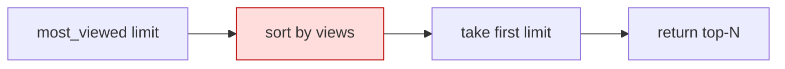

# GAL-501 · Bug · `most_viewed` returns the wrong photo

| Field | Value |
|-------|-------|
| **Key** | GAL-501 |
| **Type** | Bug |
| **Priority** | High |
| **Severity** | Major |
| **Status** | Open |
| **Sprint** | Sprint 41 |
| **Affects version** | starter-1.0 |
| **Components** | `labs/starter` (python/java/csharp `GalleryService`) |
| **Labels** | bug, regression, good-for-bug-lab |
| **Reporter** | QA Automation |
| **Assignee** | Unassigned |

## Summary

`GalleryService.most_viewed(limit)` (and its Java/C# equivalents) returns photos in the **wrong
order** — it does not reliably return the highest-viewed photos. `most_viewed(1)` returns a photo
that is *not* the single most-viewed item.

## Environment

- `labs/starter/python` (`gallery/service.py`), `labs/starter/java`, `labs/starter/csharp`.
- Reproducible against the bundled sample data.

## Steps to reproduce

```text
1. cd labs/starter/python
2. python -c "from gallery.service import GalleryService as G; \
     from gallery.sample_data import PHOTOS; \
     print([p.views for p in G(PHOTOS).most_viewed(1)])"
3. Observe the returned photo's view count.
```

## Expected vs actual

- **Expected:** `most_viewed(1)` returns the photo with the **maximum** `views`.
- **Actual:** returns a photo with a lower view count (appears to sort ascending, or slices
  before sorting).

## Simulated attachments

- `most-viewed-repro-output.png` — terminal showing the wrong view count returned.
- `expected-vs-actual-table.png` — side-by-side of expected top-N vs actual.

## Architecture / suspected cause



Suspected: sort **direction reversed**, or `limit` applied **before** sorting. Fix the ordering
so the top `limit` photos by descending `views` are returned.

## Acceptance criteria (fix)

```gherkin
Scenario: Single most viewed
  Given photos with distinct view counts
  When I call most_viewed(1)
  Then the returned photo has the maximum views

Scenario: Top-N ordering
  When I call most_viewed(3)
  Then exactly 3 photos are returned in descending view order

Scenario: Limit larger than dataset
  Given 2 photos
  When I call most_viewed(5)
  Then both photos are returned, descending, without error

Scenario: Ties are stable
  Given two photos share the top view count
  Then ordering is deterministic across runs

Scenario: Non-mutation
  Then the service's underlying photo list is not reordered as a side effect
```

## Test notes (bug lab)

Pairs with **Lab 08**. Write a failing test first: `most_viewed(1)` returns the single highest
view count. Then fix ordering and confirm green, plus the top-N, limit-overflow, tie, and
non-mutation cases.

## Definition of done

- [ ] Failing regression test added and now passing.
- [ ] Correct descending order; limit-overflow and tie handling covered.
- [ ] Fix mirrored across python/java/csharp starters as applicable.

## Activity

- **2026-01-21** — QA filed with repro output.
- **2026-01-21** — Triage: reproduced on the sample data; tagged for the bug lab.
