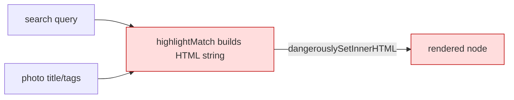

# GAL-502 · Bug · Stored XSS via unescaped search highlight

| Field | Value |
|-------|-------|
| **Key** | GAL-502 |
| **Type** | Bug (Security) |
| **Priority** | Critical |
| **Severity** | Critical |
| **Status** | Open |
| **Sprint** | Sprint 41 (expedited) |
| **Components** | `gallery`, `app/gallery`, `lib/gallery-utils` |
| **Labels** | security, xss, owasp-a03, good-for-review-lab |
| **Reporter** | Security Review |
| **Assignee** | Unassigned |
| **CWE** | CWE-79 (Cross-site Scripting) |

## Summary

A search-term **highlight** feature renders matched text using `dangerouslySetInnerHTML` without
escaping. Photo metadata (title/tags) and the user's query are injected as raw HTML, allowing
**script execution** — a stored/reflected XSS depending on the field source.

## Environment

- `/gallery` live search (`src/app/gallery/page.tsx`) and any highlight helper in
  `src/lib/gallery-utils.ts`.

## Steps to reproduce

```text
1. Create/import a photo whose title is:  
2. Open /gallery and search for "img" (or any term that highlights the title).
3. Observe the alert firing — arbitrary script executed in the page context.
```

Reflected variant: a crafted `?q=` value echoed into the highlight markup.

## Expected vs actual

- **Expected:** matched text is highlighted as **text**; any HTML in titles/tags/query is escaped
  and rendered inert.
- **Actual:** raw HTML is injected and executed.

## Simulated attachments

- `xss-repro-alert.png` — the alert dialog firing from a crafted title.
- `xss-payload-network.png` — payload flowing from data → DOM.

## Architecture / suspected cause



**Fix direction**

- Do **not** use `dangerouslySetInnerHTML` for highlighting. Split text around matches and render
  segments as React nodes (`<mark>` around matches), letting React escape all text.
- Escape/normalize the query; treat regex metacharacters literally.

## Acceptance criteria (fix)

```gherkin
Scenario: HTML in metadata is inert
  Given a photo title contains ""
  When it appears in results
  Then the markup is shown as text and no script executes

Scenario: Highlight without HTML injection
  When I search "port"
  Then matching substrings are wrapped in <mark> as React nodes, not raw HTML

Scenario: Regex-special query is safe
  When I search "(" or "." or "[a-z]"
  Then it is treated literally and does not throw or over-match

Scenario: Reflected query is escaped
  Given a crafted ?q= payload
  Then it renders as text with no execution

Scenario: No match, empty query
  Then plain text renders unchanged
```

## Test notes (review/security lab)

Pairs with **Lab 10**. Add a `highlightMatch` test block covering: no query, no match, single and
multiple matches, case-insensitivity, regex-special characters, and an HTML/script payload that
must render inert. Assert rendered **text**, never `innerHTML`.

## Definition of done

- [ ] `dangerouslySetInnerHTML` removed from the highlight path.
- [ ] Query escaped; matches rendered as React `<mark>` nodes.
- [ ] Regression tests including a script payload are green.
- [ ] Security review sign-off.

## Activity

- **2026-01-22** — Filed Critical; expedited into Sprint 41.
- **2026-01-22** — Confirmed reflected + stored variants.
