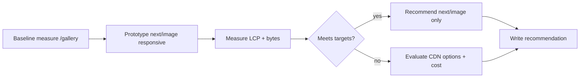

# GAL-601 · Spike · Evaluate responsive images / CDN strategy

| Field | Value |
|-------|-------|
| **Key** | GAL-601 |
| **Type** | Spike |
| **Priority** | Medium |
| **Status** | To Do |
| **Timebox** | 2 days |
| **Sprint** | Sprint 45 |
| **Components** | `gallery`, `app`, build/infra |
| **Labels** | spike, performance, images |
| **Reporter** | M. Larsson (Tech Lead) |
| **Assignee** | Unassigned |

## Goal

Decide how the gallery should serve images at scale: responsive sizes, formats (WebP/AVIF), and
whether to introduce a CDN or lean on `next/image` + `sharp` (already a dependency). Produce a
recommendation with trade-offs — **no production code** beyond a throwaway prototype.

## Questions to answer

1. Does `next/image` (with the existing `sharp`) meet our needs for responsive `srcset` and modern
   formats without a third-party CDN?
2. What are the LCP / bytes-transferred improvements on `/gallery` with responsive images vs the
   current approach?
3. If a CDN is warranted, what's the integration cost and cache-invalidation story?
4. Impact on the upload pipeline (GAL-200) — do we generate derivatives on upload?

## Approach



## Simulated attachments

- `lcp-baseline-vs-prototype.png` — Lighthouse LCP comparison.
- `bytes-transferred-chart.png` — payload sizes across breakpoints.
- `cdn-options-matrix.png` — cost/feature comparison grid.

## Deliverables

- A short recommendation doc (decision + rationale + rough cost).
- Baseline vs prototype metrics (LCP, total image bytes at mobile/desktop).
- Follow-up stories created if we proceed (e.g., "Adopt next/image on gallery grid",
  "Generate WebP/AVIF derivatives on upload").

## Acceptance criteria (spike)

```gherkin
Scenario: Decision recorded
  Then a recommendation (next/image-only vs +CDN) is documented with trade-offs

Scenario: Evidence attached
  Then baseline vs prototype LCP and byte metrics are included

Scenario: Follow-ups created
  Then any implementation work is captured as new backlog stories

Scenario: Timebox respected
  Then work stops at 2 days regardless of completeness, with findings so far recorded
```

## Definition of done

- [ ] Recommendation doc merged to the repo (or linked).
- [ ] Metrics captured; follow-up stories filed.
- [ ] No production feature code shipped from the spike.

## Activity

- **2026-02-12** — Timeboxed to 2 days; blocks scaling decisions for GAL-100/GAL-200.
