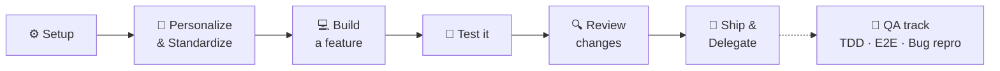

# GitHub Copilot Fundamentals Labs

Welcome! This is a hands-on lab track for learning **GitHub Copilot** by doing real, everyday development work in the **Photo Gallery & Portfolio** application.

Unlike a single long walkthrough, this track is built as **short, focused labs**. Each lab:

- Takes **15–45 minutes**
- Is broken into **short stages (~5 min each)** that each explore one Copilot feature
- Uses a **real-world scenario** you'd hit on the job
- Comes in **your language** — pick TypeScript, Python, Java, or C#
- **Ends by shipping**: you push your branch, open a Pull Request, and let **Copilot review your code**
- Leaves you with **take-home artifacts** (custom instructions, prompt files, skills, agents) you can drop straight into your own repositories

> These labs are designed for a **Fundamentals** audience. You do **not** need prior Copilot experience — just curiosity.

## 🧭 The workflow you'll practice

The labs follow the real developer inner loop, one lab per stage:



## 📚 Lab index

### 🎯 Core track (Labs 0–5)

| # | Lab | Time | You'll practice | Take-home artifact | Status |
| - | --- | ---- | --------------- | ------------------ | ------ |
| 0 | [Setup](00-setup.md) | ~5 min | Sign-in, modes, `/` `#` `@`, model picker | A working environment | ✅ Ready |
| 1 | [Personalize & Standardize](01-personalize-and-standardize/README.md) | ~30 min | Custom instructions, prompt files, skills, agents, chat sharing | A full `.github/` customization pack in your language | ✅ Ready |
| 2 | [Core Development](02-core-development/README.md) *(longest)* | ~40 min | Ask/`/explain`, `#codebase`, inline & Next Edit Suggestions, Plan & Agent modes | A feature built with your own prompt/skill | ✅ Ready |
| 3 | [Unit Testing](03-unit-testing/README.md) | ~22 min | `/tests`, Agent mode, `/fix`, coverage prompts | A reusable unit-test prompt file + tests | ✅ Ready |
| 4 | [Reviewing Changes](04-reviewing-changes/README.md) | ~18 min | Inline review, Source Control review, commit-message gen, **Copilot PR review** | A team review-standards instructions file | ✅ Ready |
| 5 | [Debug, Document & Delegate](05-debug-document-delegate/README.md) *(bonus)* | ~22 min | `/fix`, `/doc`, MCP issue creation, Cloud Agent | Docs + your first cloud-agent PR | ✅ Ready |

### 🧪 QA & Testing track (Labs 6–8)

Optional QA-focused labs that reuse the same app and starter services — great for testers, SDETs, and anyone who owns quality.

| # | Lab | Time | You'll practice | Take-home artifact | Status |
| - | --- | ---- | --------------- | ------------------ | ------ |
| 6 | [TDD from a Work Item](06-tdd-from-workitem/README.md) | ~28 min | Red-green-refactor, Ask & Agent modes | `workitem-to-tests.prompt.md` | ✅ Ready |
| 7 | [E2E UI Testing (Playwright + MCP)](07-e2e-playwright/README.md) | ~35 min | Playwright, **Playwright MCP**, Agent mode drives the browser | Playwright suite + `.vscode/mcp.json` | ✅ Ready |
| 8 | [Bug Repro → Report → Delegate](08-bug-repro-report-delegate/README.md) | ~26 min | Repro tests, bug-report prompt, **coding agent** delegation | `bug-report.prompt.md` + issue template | ✅ Ready |

### 🔀 Migration & Modernization track (Lab 9)

An advanced, single migration scenario — **no language picker** (source **Tcl** → target **TypeScript**).

| # | Lab | Time | You'll practice | Take-home artifact | Status |
| - | --- | ---- | --------------- | ------------------ | ------ |
| 9 | [Migrate Tcl → TypeScript](09-tcl-to-typescript/README.md) | ~50 min | Legacy comprehension, a custom **migration agent**, an annotate-and-ask prompt, Plan mode, behavior-parity testing | Migration agent + `annotate-tcl.prompt.md` + ported TypeScript | ✅ Ready |

## 🌐 Pick your language

Every lab is offered in four languages. **Pick the one you use at work** — the Copilot skills are identical, only the code differs, and the artifacts you build will be relevant to your day job.

| Language | Track file (in each lab) | Starter code for Labs 2-8 |
| -------- | ------------------------ | ------------------------- |
| TypeScript / React | `typescript.md` | The real gallery app (already in this repo) |
| Python | `python.md` | [`labs/starter/python`](starter/python/README.md) |
| Java | `java.md` | [`labs/starter/java`](starter/java/README.md) |
| C# | `csharp.md` | [`labs/starter/csharp`](starter/csharp/README.md) |

> Lab 1 does not require any starter code — you'll be creating configuration and customization files that apply to whatever code you write next.
>
> **Lab 9 (Tcl → TypeScript)** is a single migration scenario with no language picker; it uses [`labs/starter/tcl`](starter/tcl/README.md).

## 🔁 How every lab works

1. **Start on your own branch.** Each lab uses a fresh branch so it becomes a clean Pull Request:
   ```bash
   git checkout main
   git pull
   git checkout -b USERNAME/lab-1-personalize
   ```
2. **Work through the short stages.** Each stage explores one Copilot feature and takes about 5 minutes. Stages **ramp up**: the early ones hand you the exact prompts; the later **🧗 Challenge** stages give you a goal and success criteria and let *you* craft the prompt (with a collapsible hint if you get stuck).
3. **Ship it.** The final stage of every lab pushes your branch, opens a PR, and asks **Copilot to review your code**.
4. **Check the boxes.** Use the Completion Checklist at the end to confirm you got the reps in.
5. **Keep your artifacts.** Everything you build under `.github/` is yours to reuse in real repos.

## ✅ Before you start

Complete the one-time [Setup](00-setup.md) lab, then begin with [Lab 1: Personalize & Standardize](01-personalize-and-standardize/README.md).

Happy building! 🚀
